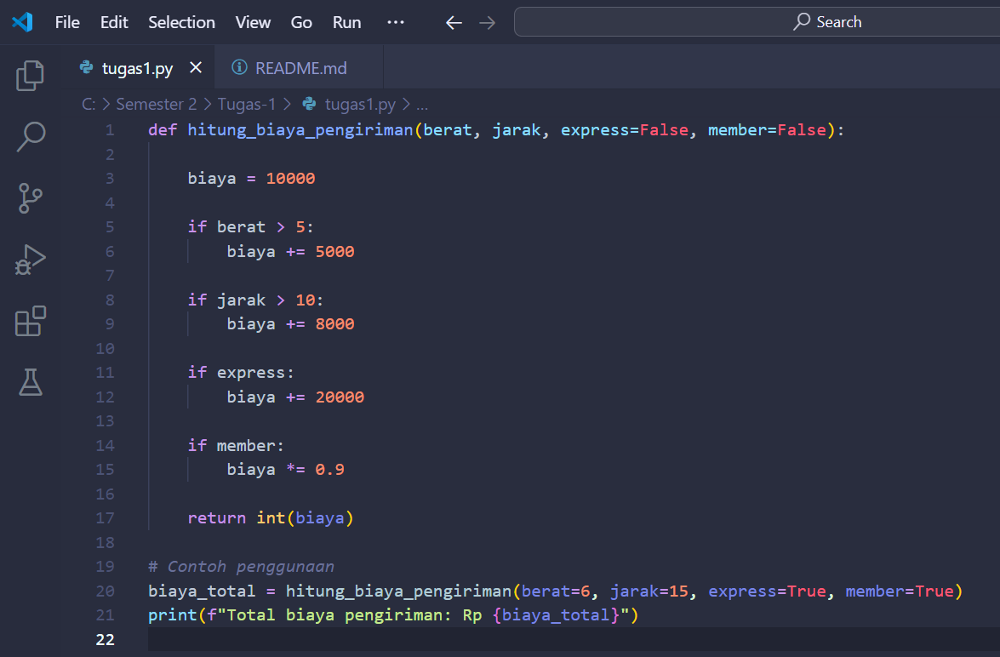
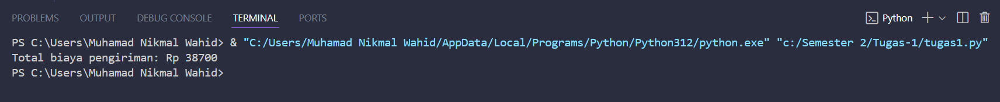

Program ini menghitung biaya pengiriman  

1. **def hitung_biaya_pengiriman(berat, jarak, express=False, member=False):**
   - `def` digunakan untuk mendefinisikan fungsi dengan nama `hitung_biaya_pengiriman`.
   - Fungsi menerima empat parameter: `berat`, `jarak`, `express`, dan `member`.
   - `express` dan `member` memiliki nilai default `False` jika tidak diberikan.

2. **biaya = 10000**
   - Variabel `biaya` diisi dengan nilai Rp 10.000 sebagai biaya dasar (tanpa diskon) 

3. **if berat > 5:**
   - Jika berat paket lebih dari 5 kg, maka tambahan biaya Rp 5.000 ditambahkan ke `biaya`.

4. **if jarak > 10:**
   - Jika jarak pengiriman lebih dari 10 km, maka tambahan biaya Rp 8.000 ditambahkan ke `biaya`.

5. **if express:**
   - Jika layanan express dipilih (`True`), maka tambahan biaya Rp 20.000 ditambahkan ke `biaya`.

6. **if member:**
   - Apabila pelanggan adalah member (`True`), maka total biaya diberikan diskon 10% (`biaya *= 0.9`).

7. **return int(biaya):**
   - Mengembalikan total biaya dalam bentuk integer.

8. **Contoh Penggunaan:**
   - Memanggil fungsi dengan `hitung_biaya_pengiriman(berat=6, jarak=15, express=True, member=True)` untuk menghitung biaya pengiriman dengan parameter tertentu.
   - Hasilnya dicetak menggunakan `print(f"Total biaya pengiriman: Rp {biaya_total}")`.

